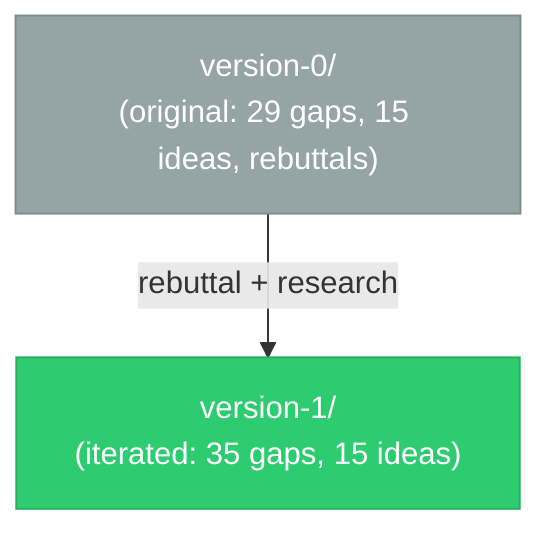
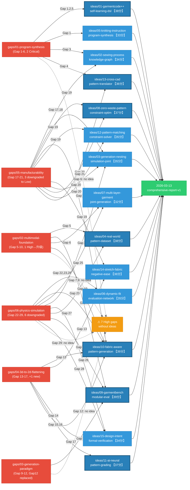

# Context Map

## Version Overview

## Version 0 (Archived)

All v0 files are in `context/version-0/`. Structure:

- `gaps/` — 6 gap direction files (29 gaps total)
- `ideas/` — 15 idea proposals
- `rebuttal/` — 6 gap rebuttals + 15 idea rebuttals
- `2026-03-12-gaps-and-ideas-comprehensive-report.md` — v0 entry point

## Version 1 (Current)

Entry point: `context/version-1/2026-03-13-gaps-and-ideas-comprehensive-report-v1.md`

### Gap-Idea Mapping

### v0→v1 Key Changes

| Metric | v0 | v1 |
| ------ | -- | -- |
| Total Gaps | 29 | 35 (+6 new) |
| Critical Gaps | 10 | 2 (-8) |
| Low/Engineering Gaps | 0 | 4 (+4) |
| Idea avg score | 35.3 | 35.7 |
| Idea max score | 42 | 39 (more calibrated) |

**Core shift**: v0 over-classified engineering tasks as Critical research gaps. v1 distinguishes:

- **Research Gaps**: Need new methods/theory (e.g., DSL expressiveness, VLM quantitative reasoning)
- **Cross-domain Integration**: Tech exists elsewhere, needs transfer (e.g., library learning, differentiable nesting)
- **Engineering Tasks**: Deterministic operations with mature tools (e.g., seam allowance, DXF export)
